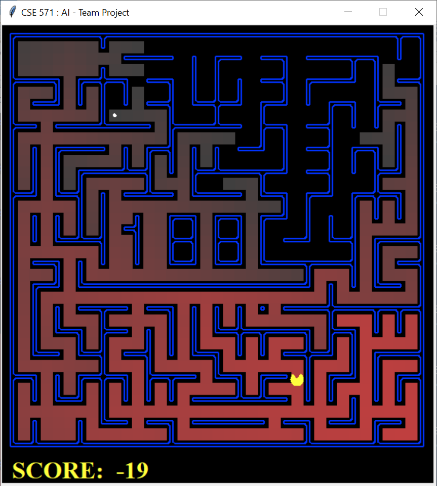

# CSE571-Final_Project : Bi-Directional Search

- Paper : https://people.engr.tamu.edu/guni/Papers/AAAI16-MM.pdf 

## Results

<table>
	<thead>
		<td>
			<b>MM</b>
		</td>
		<td>
			<b>MM0</b>
		</td>
	</thead>
	<tr>
		<td>
			
		</td>
		<td>
			
		</td>
	</tr>
 </table>
 <table>
  <thead>
		<td>
			<b>BFS</b>
		</td>
		<td>
			<b>DFS</b>
		</td>
    <td>
			<b>UCS</b>
		</td>
		<td>
			<b>A-STAR</b>
		</td>
	</thead>
	<tr>
		<td>
			
		</td>
		<td>
			
		</td>
    <td>
			
		</td>
		<td>
			
		</td>
	</tr>
</table>

